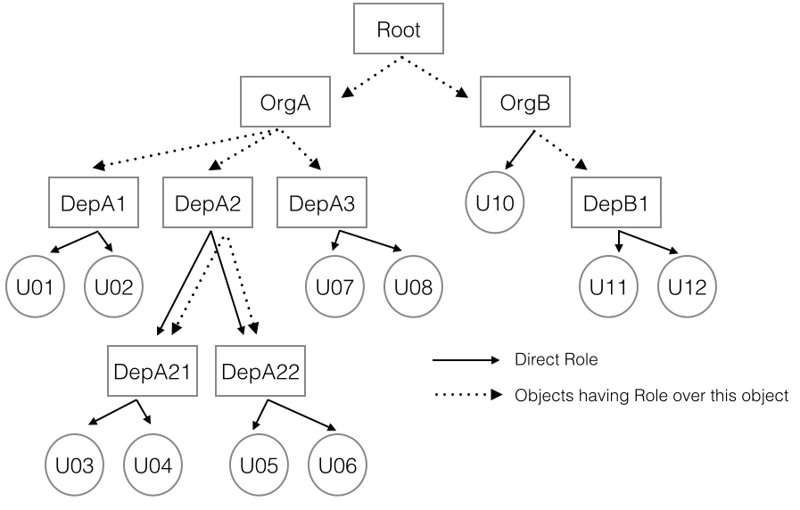

# Introduction

NkROLE is a framework for managing complex relations among arbitrary objects in an Erlang cluster. You can create any number of generic objects and define relations among them, based on _roles_. Any object can _have_ any _role_ over any other object. Also, you can define that all objects having a specific role over an object have automatically the same or other role over another object, and this complex relations can be nested at any level.

NkROLE creates a number of caches, so that, once all objects having a role over another object are found, the list is saved for future queries. If any of the base conditions used for the calculation change (because the base object or any of the objects used for the calculation have changed) all related caches are automatically invalidated (and only the related caches).

NkROLE creates a process for each used object called the _role proxy_. Role proxies have a timeout value. If no further query is received for a period of time, they are removed. Role proxies will typically be started by another Erlang process representing the real object.

For each query that involves nested roles, a cache (another Erlang process) is started for each specific role at each related proxy, also with an specific timeout value, so that new queries are very fast, even with a huge number of objects and nested relations.

NkROLE uses by default ETS storage, and you must populate it calling `nkrole_backend:put_rolemap/2`. However, you can supply the option `get_rolemap_fun` to most API calls, and it will be called to get the `rolemap` for an specific object instead of the built-in storage.


# Example1

Let's say we want to model a _member_ relationship, following this schema:


We want to say that:

* _Members_ of object `root` are all objects being _members_ of `orgA` or `orgB`.
* _Members_ of `orgA` are all objects members of `depA1`, `depA2` or `depA3`.
* _Member_ of `depA1` are `u01` and `u02`.
* _Members_ of `depA2` are `depA21`, `depA22` and also all object being members of thouse objects.
* ... and so on.

Let's say we want to create this structure:
```
$ make shell
```

```erlang
> nkrole_backend:put_rolemap(root, #{member=>[#{member=>orgA}, #{member=>orgB}]}).
ok

> nkrole_backend:put_rolemap(orgA, #{member=>[#{member=>depA1}, #{member=>depA2}, #{member=>depA3}]}).
ok

> nkrole_backend:put_rolemap(orgB, #{member=>[u10, #{member=>depB1}]}).
ok
```

and so on.

You also could first create the objects and then apply the roles:
```erlang
> nkrole_backend:put_rolemap(root, #{}).
ok

> nkrole:add_subrole(member, root, member, orgA, #{}).
ok
```

This particular structure happens to be used at the included tests, and you can create all if it at once:

```
$ make build_tests
$ make shell
```

```erlang
> test_util:insert(set1).
ok
```

Now we can query in many ways:
```erlang
> % Get direct roles
> nkrole:get_role_objs(member, orgB, #{}).
{ok, [u10, #{member=>depB1}]}

> % Get nested roles
> nkrole:find_role_objs(member, orgB, #{}).
{ok, [u10, u11, 12]}

> nkrole:find_role_objs(member, root, #{}).
{ok,[u01,u02,depA21,depA22,u03,u04,u05,u06,u07,u08,u10,u11,u12]}.

> % Check users
> nkrole:has_role(u03, member, depA21, #{}).
{ok, true}

> nkrole:has_role(u03, member, depB1, #{}).
{ok, false}

> nkrole:has_role(u03, member, root, #{}).
{ok, true}
```


# Example2

The previous test data adds also another role structure to the same schema, using the `head` role:


Imagine we want to say that all users report to their department (except `u10`), departments to their organizations, and organizations to root:

```
$ make build_tests
$ make shell
```

```erlang
> test_util:insert(set1).
ok
```

Now we can query:
```erlang
> nkrole:get_role_objs(head, u05, #{}).
{ok,[depA22,#{head=>depA22}]}

> nkrole:find_role_objs(head, u05, #{}).
{ok,[depA22, depA2, orgA, root]}
```

This second example is very similar to the case for nested configuration, where an object is configured based on one or more _parents_.


# Configuration

NkROLE uses standard Erlang application environment variables. The same Erlang application is used for agents and controllers. 

Option|Type|Default|Desc
---|---|---|---
proxy_timeout|`pos_integer()`|`180000`|Timeout for proxy objects
cache_timeout|`pos_integer()`|`180000`|Timeout for cache objects
